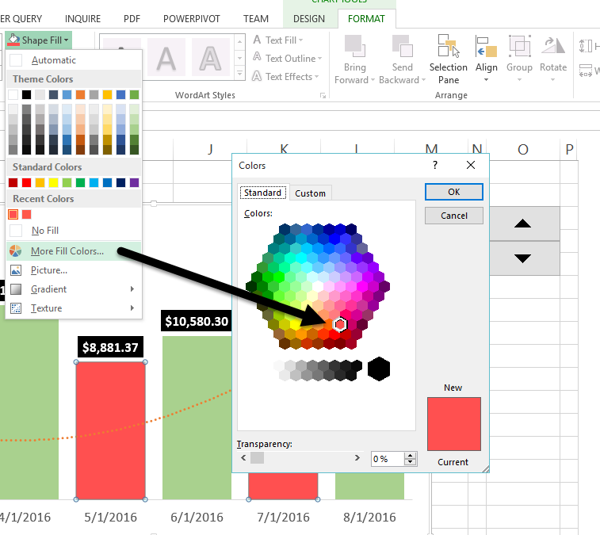

##### **“If I paint something, I don't want to have to explain what it is.”**

<!-- more -->

###### **\-Bob Ross**

* * *

A common theme you will hear me discussing is storytelling. "They" say a picture is worth a thousand words, and the human eye is receptive to shapes and colors as a means for detecting object variances. That's why telling a visual story is so important, and **[finally](https://www.youtube.com/watch?v=sGwgMeO5cF4&feature=youtu.be&t=7)**, that brings us to the presentation of data in graphical format commonly known as data visualization.

* * *

### **Visualizing Data Is An Art Form**

The chart below alone utilizes the following features - IF, SMALL, LARGE, Number Formatting, Gap Width, Trendline and Data Labels. Quite a bit of work for just 6 bars right? But through all of these layers, you end up making an attractive chart object that is easy for your end users to analyze at a simple glance.

###### **"Within the last 6 months we are currently trending upward. Our lowest month in terms of revenue was that of January of 2016"**

* * *

#### Quit Staring At It And Start Making It

[Download Workbook](http://itsnotaboutthecell.com/wp-content/uploads/2015/05/ChartTest.xlsx)

* * *

Function: **SMALL**

**Describe It**:

- Returns the smallest positioned value from a range of information.

**Syntax**:

- \=SMALL(array,k)
    - The array is a list of numerical values
    - The k is the position from the smallest value

**Make It:**

- \=SMALL(tblAltChart\[Total Sales\],3)
    - k returns the 3rd smallest value in the range

**Quick Tip:**

- The **LARGE** (Largest Value) function is the exact opposite of the **SMALL**

**Make It:**

- \=LARGE(tblAltChart\[Total Sales\],1)
    - k returns the 1st largest value in the range

<iframe src="https://www.youtube.com/embed/y1kYQQF0b_w" width="560" height="315" frameborder="0" allowfullscreen="allowfullscreen"></iframe>

 

As standalone functions, LARGE and SMALL are "**nice**" to know but they really aren't helpful in telling a visual story by themselves. Utilizing what we learned in the [IF statements and Comparison Operators](http://itsnotaboutthecell.com/2015/08/10/we-need-to-talk/) lesson, we can talk through our problems and create a nested function to display these variances.

**Ask the question:**

**"How do I highlight the 3 lowest months of total sales in a 6 month period?"**

**Talk It Out:**

**If** the value is **less than or equal to** the 3 **smallest** values in a 6 month **range** return the value, **if not equal to** return no results.

**Make It:**

- Table Column SMALLEST:
    - \=IF(\[@\[Total Sales\]\]<=SMALL(\[Total Sales\],3),\[@\[Total Sales\]\],"")

**Pro Tip:**

- Because we are dealing with **IF** statements and **Boolean** (TRUE | FALSE) all we have to do is switch our formula order.
- Table Column LARGEST:
    - \=IF(\[@\[Total Sales\]\]<=SMALL(\[Total Sales\],3),"",\[@\[Total Sales\]\])

<iframe src="https://www.youtube.com/embed/QFJ8_VumEq8" width="560" height="315" frameborder="0" allowfullscreen="allowfullscreen"></iframe>

* * *

**Modern Visualization**

Gone are the days of the standard [RGB](https://en.wikipedia.org/wiki/RGB_color_model) charts with grid lines and axis labels all over the place. We are now in a sleek, sexy world of information where less is always more. Software developers everywhere are getting rich selling [business intelligence](http://www.docurated.com/all-things-productivity/50-best-business-intelligence-tools) visualization tools. **Why?** That's a great question, because once you peek behind the curtain, the majority of software services are simply passing Excel workbooks through their funnels. Instead of letting your boss give them your well-deserved raise, how about taking advantage of all of the features that already exist within the program?

* * *

##### Just as a warning, you'll need to watch this video several times so don't get frustrated with the written instructions. Just pick one section at a time, master it and move on.

<iframe src="https://www.youtube.com/embed/vCuTlE1KoGs" width="560" height="315" frameborder="0" allowfullscreen="allowfullscreen"></iframe>

 

**Make It:**

- Insert Tab and create a blank 2-D Column bar chart
- Right Click to Select Data
- Legend Entries (Series) - Add
    - Series Name: Smallest Table Header
    - Series Values: Smallest Table Range
- Legend Entries (Series) - Add
    - Series Name: Largest Table Header
    - Series Values: Largest Table Range
- Horizontal (Category) Axis Labels - Edit
    - Month Range
- Select OK to complete

### Let's Move Into The Modern Age....

Select and Delete

- Axis
- Gridlines

### **Series Options**

Select a chart element, right click and go to Format Data Series...

**Series Overlap**

Dealing with multiple series, Excel's natural instinct is to organize the series adjacent to each other. Since our values will be coming from either the Smallest or the Largest column, we want to recenter our chart elements.

- To center the chart elements adjust the overlap to 100%.

**Gap Width**

- To control the width of your chart elements, adjust the percentage amount for the example I used: 25%.

### **Chart Elements**

Through the use of soft colors, you can create a visually stunning end-user experience. By alternating those colors, you can highlight data variations and create a rhythmic experience for your interactive charts.

- Select the largest series chart elements, go to format and shape fill Green, Accent 6, Lighter 40%.
- Select the smallest series chart elements, go to format and shape fill series a less opaque red (if present). Often, you may have to get creative with selecting a color that is outside of Excel's normal templates. You can do this by going to the More Fill Colors... option and playing around with the Standard tabs colors palette. If you have to adhere to special branding colors you can use the Custom tab to specify the RGB values.

## **Trendlines**

With trendlines, you can show how information is trending across a set period of time, by using the largest value chart elements you will notice them visually taking into account the variances between the largest and smallest items.

- Select one of the largest bar chart elements
- Right Click
- Add Trendline...

#### **Menu: Trendline Options**

- Select Polynomial

#### **Menu: Fill & Line**

- End Arrow Type - Select Arrow

## **Data Labels**

- Select the largest chart element to start and right-click Add Data Labels
- Select the Data Labels and go to the Home tab
- Select Fill Color use a solid Black, Text 1
- Select Font Color and use White, Background 1
- Select the Bold option to make the numbers really stand out

#### Menu: Label Options

Within the Format Data Labels, Label Options menu, we will want to ensure we are styling our values correctly.

**Section: Label Contains**

Select Value

**Problem:**

Once you enable the data labels you will notice 0 (Zero) values are visible on the chart for the alternating months. With custom format codes you can visually hide these results.

**Section: Number**

**Category:** Currency

**Solution:**

Number Format Codes are separated by semicolons with the following properties.

### **(Positive ; Negative ; Zero ; Text)**

Using the above rules we are telling the machine to display - (**Positive** currency values ; **Negative** values as blank ; **Zero** values as blank ; and **Text** values as blank.)

Format Code: $#,##0.00;;;

Select Add

**So Nice - Had To Do It Twice**

By now, you realize that only the largest values have the data label options present, go ahead and do the steps above within the Data Labels section to the smallest group to replicate.

* * *

 

###### “_The object of art is not to reproduce reality, but to create a reality of the same intensity_.”

###### **Alberto Giacometti**

 

* * *

I'm not going to lie, what I originally thought was as simple as describing 6 bar charts turned into a MONSTROUS lesson. But you know what? [It happens](https://youtu.be/-jcv6mh0uok?t=11). People care about the end product, and you're the expert that is going to get them there, no matter how big or small the task is. **Excel is a tool, you are the resource**. Never lose sight of that.

