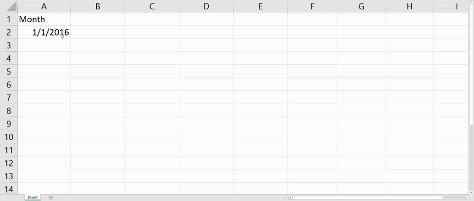
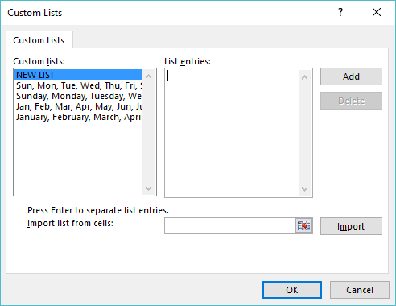

If repetition is the key to mastery, repeating an activity the wrong way is a killer in disguise. A countless waste of hours dedicated to a mundane task. Fortunately, Excel is intended to avoid such things, and the distance between **getting it done** and **being a master** is much shorter than you may realize.

<!-- more -->

|   ### killer   |   ### filler   |
| --- | --- |
|   \[kil\-er\]  verb, Slang  task or activity, that is particularly taxing or exhausting   |   \[fil\-er\]  verb, Auto  populate cells based upon a pattern or data found within other cells    |

## **"If you do what you've always done, you'll get what you've always gotten."**

#### Tony Robbins

* * *

#### DOWNLOAD WORKBOOK

* * *

### Auto Fill Options

Information populated or returned by Auto Fill is direction-dependent.

**Example:**

- **Dates** move the fill direction up to return dates from the past or down into the future. Likewise left returns past, right returns future.
- **Numbers** move the fill direction up to return smaller numbers or down to return larger numbers. Likewise left returns smaller, right returns larger.

### Activate It:

- Start by selecting a cell that contains information.

- Within the right-hand corner of the active cell you can utilize Auto Fill by either dragging the handle to the desired height or by double-clicking if data already exists to populate current dimensions. You will notice your cursor turns into a **+** sign when you hover above the cell's corner.

- While the Auto Fill is still your current action, you will now have the Auto Fill Options menu button at the bottom right corner.

### Start Exploring:

**Copy Cells**

- Copies the cell contents as well as any formatting.

**Pro-Tip:** 

If you don't want to constantly deal with the Auto Fill menu there are a couple shortcuts available for you in a pinch.

- Horizontal Fill (Right)
    - Select the cell you would like to copy
    - Either drag your mouse or hold shift to expand the selection range within the current row. Ensure the cell selected above is the left-most cell within the range.
    - Press **CTRL + R**
- Vertical Fill (Down)
    - Select the cell you would like to copy
    - Either drag your mouse or hold shift to expand the selection range within the current column. Ensure the cell selected above is the upper-most cell within the range.
    - Press **CTRL + D**

**Fill Series**

- Fills cell formatting and whole numbers (no decimals).

**Fill Formatting Only**

- Fills cell formatting (borders, font, colors, et cetera).

**Fill Without Formatting**

- Fills series sans formatting.

**Fill Weekdays**

- Returns the next calendar weekdays (Monday through Friday).

**Fill Months**

- Returns a calendar month, retains the same starting day.
    - End-of-month results adjust accordingly if thirty or thirty-one days and account for leap years.

**Fill Years**

- Returns the next calendar year, retains the same starting day.
    - End-of-month results adjust accordingly if thirty or thirty-one days and account for leap years.

* * *

Not bad, not bad - changing a number data type seems fairly easily, but surely Excel [munsoned](http://www.urbandictionary.com/define.php?term=munsoned) it when it came to text, right? **WRONG.**

* * *

Type some of the below values into your worksheet and use the Auto Fill method to populate subsequent results.

**Months:**

- January
- Jan

**Weekdays:**

- Monday
- Mon

**[**Ordinal Indicators**](https://en.wikipedia.org/wiki/Ordinal_indicator):**

- 1st

**Financial Calendar:** (Stops at 4 Automatically)

- Quarter 1
- Q1

**Prefix or Suffix:**

- Cat 1
- 1 Cat

**Build Your Own:**

Maybe you're tired of typing all your co-workers' names or copying and pasting the same test questions over and over. Now is the time when we work smarter - not harder within Excel.

- File
    - Options
- Advanced tab
    - Navigate to the **General** section
- Edit Custom Lists...

**Notes:**

You can either type static values into the **List Entries** field or utilize the Cell Selector from the **Import List from Cells** option to import a static list.

- After using the **List Entries** box press **Add** to complete
- When using the **Import List from Cells** press **Import** after cells selected
- To delete custom items, select them from within the **Custom Lists** section and press the **Delete** button on the form.

* * *

These are all neat little tricks, you say, but for the love of all that is holy what about existing data?! Alright, alright, I feel your pain, but this is where Flash Fill comes in handy.

**Try It:**

- In the column titled **First Name**, type the adjacent last-name value from the column **Full Name** for a few entries until Excel recognizes a pattern
- **Note:** Do not complete typing the full value once Excel displays a transparent list of values. Simply press **ENTER** to complete.

**Try It Again:**

- In the column titled **Last Name**, type the adjacent last-name value from the column **Full Name**
- Select the top-most populated value, go to the **Home** tab, select **Fill** and then **Flash Fill** to complete
    - **Pro-Tip:** Ctrl+E

**But Why?!**

Data entry and manipulation is a necessary evil. **FACT.** I told you the distance between using Excel and mastering Excel is not long. Let's put this in perspective for extracting domains. You can either create a nested function with a combination of **RIGHT, LEN, FIND**, or just type a couple entries and allow Flash Fill to do the heavy lifting. But hey what do I know? I'm just a Microsoft Office Excel 2010 Specialist and a 2010 and 2013 Expert ([Why aren't you certified as a MOS yet](https://www.microsoft.com/en-us/learning/mos-expert-certification.aspx)?).

- **\=RIGHT(\[@\[E-mail\]\],LEN(\[@\[E-mail\]\])-FIND("@",\[@\[E-mail\]\],1))**

* * *

## **This One Weird Trick Saved Me 8,760 Hours a Year!**

Do not tell your boss, mailman or the family pet because this next trick will blow people's minds if they were to ever find out.

**Try It:**

- Within the right-hand corner of the active cell press, **right-click and hold (CRAZY RIGHT?!)** and drag to desired height
    - You will notice fill options as well as Flash Fill are available using this method

**Pro Tip:**

In the example above, I use the **Series...** option and chose a Step Value of 10 to add 10 days to each value within the range. The **Series...** option is incredibly powerful and I encourage you to get curious on how you could use it in your own line of work.

* * *

> ###### **“An amateur practices until he can do a thing right, a professional until he can’t do it wrong.”**
> 
> Percy C. Buck

* * *

Being good at something is the bare minimum required for entry.  There is no shame in desiring to be the absolute best and vocalizing this desire among friends, family or colleagues. Find a mentor, [read some books](http://www.mrexcel.com/store/index.php), [embrace a year of fear](http://heykendra.com/yearoffear/) - whatever needs to be done to get you to your goal. People want to invest in people who invest in themselves.
