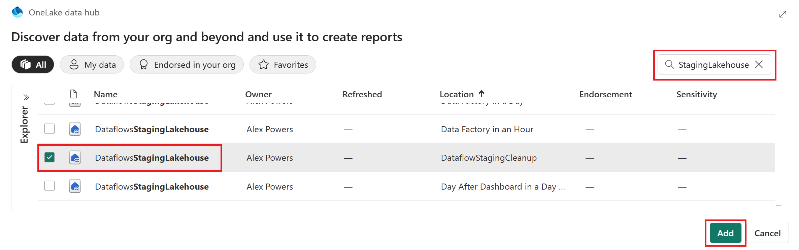
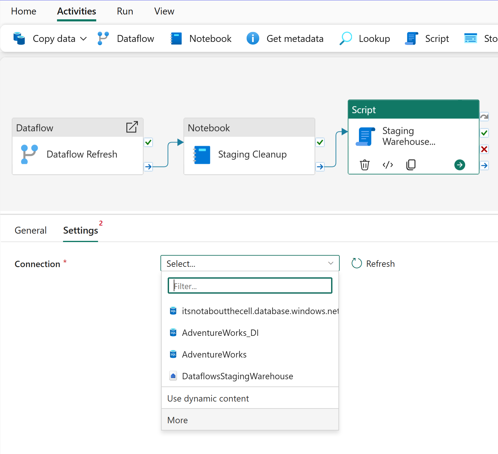
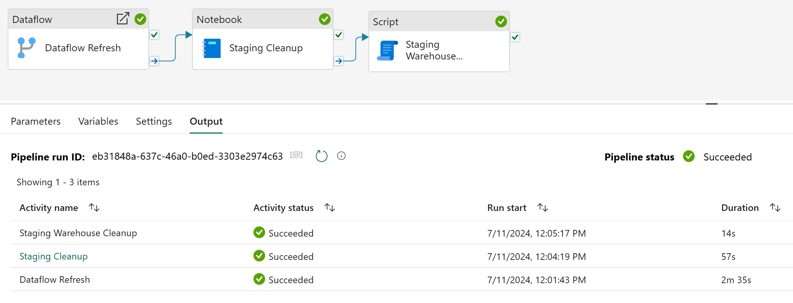

Dirty lakes need cleaning, simple as that - and it's no different when it comes to Dataflow Gen2's staging feature. You might be wondering, "What's the big deal?" Well, let's dive into and dissect the backend staging setup of dataflows in the Lakehouse. Close your eyes and imagine countless system tables, each tagged with lengthy identifiers that intertwine with your actual query names—think `some-random-crazystring_Address_002E.parquet`. And within these auxiliary tables? **YOUR DATA** alongside generic column titles like Column1, Column2, Column3 (metadata too! don't worry your column names aren't lost!). But every single query leveraging staging, is using this backend implementation approach - ultimately contributing to data sprawl in my opinion.

<!-- more -->


* * *

Now that your curiosity is piqued, let's take a slight detour and delve deeper into the world of dataflows.

Embracing Dataflow Gen2 without altering your approach from Dataflow Gen1 is a path I **STRONGLY** want you to reconsider. Hold the "but, but, but!" and hear me out. I understand the familiarity of 'Get data > from Dataflow' in Power BI, Excel, and Power Apps. I've been there, it's awesome, but I'm now pleading **STOP** doing it that way.

"Tried and true - why change?" Ok, here's my issue: if you skip setting a data destination, the "Dataflow" connector in Power BI, Excel, and Power Apps pulls data directly from the DataflowsStagingLakehouse. This might seem small, but I consider it a significant issue. Don't believe me, check out the images and Power Query M script below, they should look familiar.


* * *

Power Query script:

```
let
    Source = PowerPlatform.Dataflows(null),
    Workspaces = Source{[Id = "Workspaces"]}[Data],
    #"WorkspaceId" = Workspaces{[workspaceId = "CrazyWorkspaceID"]}[Data],
    #"DataflowId" = #"WorkspaceId"{[dataflowId = "CrazyDataflowId"]}[Data],
    #"NoStage" = #"DataflowId"{[entity = "NoStage", version = ""]}[Data]
in
    #"NoStage"
```

* * *

Ok, so let me go through my "airing of grievances"...

- The **DataflowsStagingLakehouse** is hidden away from the workspace UI, making it a challenge to access from a business standpoint. Sure, you can use the OneLake data hub, client tools can bridge the gap to connect to the workspace's SQL endpoint or scripting options, but not being able to easily see this in your workspace list just introduces additional complexity and work arounds.

- The table names are a complex maze of non-intuitive identifiers. Despite the metadata file in Power BI, Excel, or Power Apps providing clarity with actual table and column name values when connecting... it's simply too disconnected from one tool to the next what gets displayed.

- While garbage clean-up operations occur for removed queries from your original dataflow definition or when the dataflow item is deleted. The ambiguity of what constitutes as being "used" or "unused" can be alarming and confusing when you eventually have to evaluate what is being used in your environment. The thought of losing a pivotal table from a dataflow, sounds like a daunting prospect.

- Setting a **data destination** should be a must (If I had a magic wand, it would be required).

For those reasons...

"Always be in service to a data destination."  
\-Alex Powers-

Phew, tangent done. Basically, these seemingly arbitrary tables aren't just adding clutter and complexity —they're incurring storage costs within OneLake. (Yes, really!). Luckily, though you've already bought into the gospel of data destinations and only using staging when appropriate to achieve that incredible scale with Dataflows Gen2 - AMAZING! But please, don't stop reading just yet - let's actually start solving this problem. How? Delete the tables - every. single. time.

* * *

Putting the pieces together:

First let's start with our dataflow, highlighting three key components and their associated numbers in the image below:

1. **Staged queries**: Identified by their standard text format, these queries are earmarked for staging. A simple right-click reveals the "Enable staging" option in the context menu, confirming their destination: the DataflowsStagingLakehouse within the workspace.

3. **Non-staged queries**: These stand out in italicized text, signifying a direct data stream from the original source to the designated data destination, courtesy of the Mashup engine.

5. **Computed Tables**: These are the powerhouses, leveraging both the DataflowsStagingLakehouse and DataflowsStagingWarehouse. They execute large-scale data transformations using the Fabric warehouse. Note that without a specified data destination, these queries default back to the DataflowsStagingLakehouse, underscoring the importance of proper configuration.


Once the dataflow is in place, we'll manage the refresh and subsequent cleanup through a **Data pipeline**, complemented by the **Notebook** activity. Begin by integrating the dataflow activity, ensuring the correct dataflow is selected. For this scenario, I'll employ the "**On completion**" conditional path. This ensures that even if a dataflow encounters a partial failure, any successfully created tables and their data will still be removed from the underlying **DataflowsStagingLakehouse**.


Navigating through the Notebook's explorer, select **Data sources > Lakehouses** and then **Existing lakehouse**. In the OneLake data hub interface, use the search function with the string "StagingLakehouse." You'll encounter a multitude of lakehouses; identify the correct one for your workspace using the **Location** column and then select **Add**.



Once you're in the Notebook and within the Lakehouse explorer, you'll notice those system tables created for the staged queries are now visible. If you remember the queries without staging enabled are sent straight to their intended data destination, so you may not see the same number of tables in this area. To clear out the unnecessary tables though, insert the PySpark script provided below into a code block, which will purge all tables within the '**DataflowsStagingLakehouse**' schema.


```

from pyspark.sql import SparkSession

# Initialize Spark Session
spark = SparkSession.builder.appName("DeleteTables").getOrCreate()

# Set the schema name
schema_name = 'DataflowsStagingLakehouse'

# List all tables in the schema
tables = spark.sql(f"SHOW TABLES IN {schema_name}").collect()

# Delete each table
for table in tables:
    table_name = table['tableName']
    spark.sql(f"DROP TABLE IF EXISTS {schema_name}.{table_name}")
    print(f"Deleted table {table_name}")

# Stop the Spark Session
spark.stop()
```

* * *

Add another activity to your data pipeline by visiting **Activities** and then selecting **Script**. Within the Settings select the **More** option to launch the Get data experience.



In the Get data experience select OneLake data hub, use the search function with the string "StagingWarehouse." You'll encounter a multitude of warehouses; identify the correct one for your workspace using the **Location** column and then select the correct row option to continue.


Within the Script activity configure the conditional path as "On completion" between the Notebook and Script activities before pasting the following code block below the image.


```
DECLARE @sql NVARCHAR(MAX) = '';

-- Generate the DROP TABLE statements for all tables in the dbo schema
SELECT @sql += 'DROP TABLE ' + QUOTENAME(TABLE_SCHEMA) + '.' + QUOTENAME(TABLE_NAME) + '; '
FROM INFORMATION_SCHEMA.TABLES
WHERE TABLE_SCHEMA = 'dbo' AND TABLE_TYPE = 'BASE TABLE';

-- Execute the generated DROP TABLE statements
EXEC sp_executesql @sql;
```

* * *

Before you run the data pipeline, conduct a thorough review to ensure that your Dataflow, Notebook, and Script activities are properly set up and ready to rock-and-roll. Once you're confident everything is ready, go ahead and **Run** the data pipeline.



After the run, a quick check back in the Lakehouse explorer within the Notebook will reveal an empty **Tables** section. And just like that, we've taken out our own garbage, thank you very much!


* * *

This topic has been a nagging one for me, and fortunately I had a nudge by colleagues to address lingering confusion. Ideally, dataflows would streamline this process by automating the clean-up process upon each successful refresh. Unfortunately, as of publication, that's not the case. The additional storage costs in my personal opinion are an unnecessary burden, and I'm sure you'd agree that data should be housed in its rightful destination, not lost in this staging purgatory. The advantages of always using data destinations are countless too: from sharing individual tables to bolstering security with Lakehouse/Warehouse integration, and simplifying overall management.

While this article may not be the complete turnkey solution, it aims to understand and inspire. I envision some community contributor will propose a more sophisticated solution, with parameterized notebooks and invoked pipelines that turn this into a completely reusable process across the entire tenant.

For right now though, there's some dirty lakes (and warehouses) that need cleaning!

Shout out to [/r/MicrosoftFabric](https://reddit.com/r/MicrosoftFabric) user [Automatic-Escape5053](https://www.reddit.com/user/Automatic-Escape5053/) for the comments and contributon improvements to this article as well!
