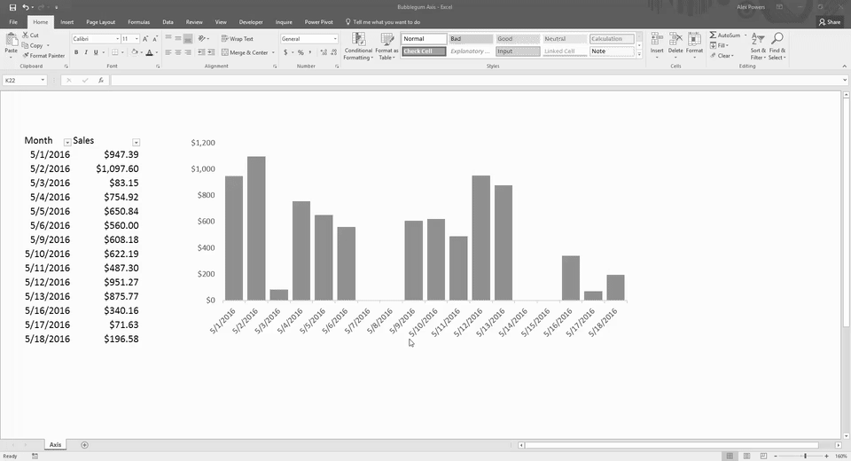

It's Dangerous To Go Alone! Take This.

<!-- more -->

* * *

### DOWNLOAD WORKBOOK

* * *

If you find yourself becoming a mindless drone, constantly wondering when it's the weekend - then it's time to add to your arsenal. Returning the calendar work days quickly can be an incredibly powerful solution to overcome this challenge, but only when used correctly.

* * *

Function: **WORKDAY**

**Describe It**:

- Returns the work date before or after a specified number of days
    - Work days are defined as Monday through Friday

**Syntax**:

- \=WORKDAY(start\_date, days, \[holidays\])
    - Start\_date is the starting value
    - Days is the number of calendar days you'd like to increase or decrease
    - Optional \[holidays\] can be a single date or an array of dates you'd like to exclude from the working calendar

**Make It:**

\=WORKDAY(TODAY(),3)

* * *

Not every industry runs on a Monday through Friday work schedule though. Sometimes you may need the flexibility to define your own custom weekend parameters.

#### Pro Tip:

Function: **WORKDAY.INTL**

**Describe It**:

- Returns the work date before or after a specified number of days

**Syntax**:

- \=WORKDAY.INTL(start\_date, days, weekend, \[holidays\])
    - Start\_date is the starting value
    - Days is the number of calendar days in which to increment or decrement
    - Weekend is a pre-defined parameter that a user can choose from
    - Optional \[holidays\] can be a single date or an array of dates you'd like to exclude from the working calendar

##### Weekend Parameters:

| **Number** | **Weekend** |
| --- | --- |
| 1 |  Saturday, Sunday |
| 2 |  Sunday, Monday |
| 3 |  Monday, Tuesday |
| 4 |  Tuesday, Wednesday |
| 5 |  Wednesday, Thursday |
| 6 |  Thursday, Friday |
| 7 |  Friday, Saturday |
| 11 |  Sunday only |
| 12 |  Monday only |
| 13 |  Tuesday only |
| 14 |  Wednesday only |
| 15 |  Thursday only |
| 16 |  Friday only |
| 17 |  Saturday only |

**Make It:**

\=WORKDAY.INTL(TODAY(),3,7)

* * *

**Ask the question:**

**“What are the total sales per workday? ”**

**Talk It Out:**

**Workdays** are defined as date values between Monday and Friday.

**Within Cell C6, Make It:**

\=WORKDAY(C5,1)

Select cell C6 and double-click the fill handle to automatically copy the formula to the adjacent cells within the table.

- Located within the bottom right hand corner of the active cell

* * *

**There's nothing more distracting than a chart with a lot of white space.**

* * *

### See What's Really There

- Right click on the horizontal axis of the chart and select Format Axis...
- In Axis Options, under Axis Type, select Text Axis

* * *

The opportunity to work with data shouldn't be viewed as a prison cell of dates and numbers, but an opportunity for change. A change in the way leaders conduct business or families balance budgets. No matter how big or small, it is through your black tinted glasses that you see the data for what it truly is - a problem waiting to be solved.
