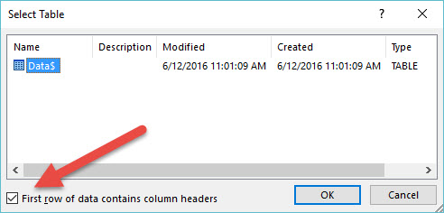
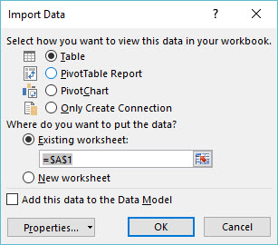

<!-- more -->

I saw you from across the Office through the [watch window](http://itsnotaboutthecell.com/2015/11/10/watch-window/). You were sitting at the [table](http://itsnotaboutthecell.com/2015/05/18/fivestardinneronatable/) with the perfectly cleansed data. I wanted to approach but just didn't know the correct queries to ask. I know we would have an instant connection - if you see this, send me your ODC file.

post id: 6988676976   posted: 2016\-07-15 12:02am

* * *

The best part about having data is having CURRENT data. Obtaining up-to-date information shouldn't be a grind of opening workbook after workbook or constantly exporting database objects. It should be a quick Refresh All and then you're on to the next problem to solve. This lesson will provide you the foundation needed in establishing design principles quickly and easily to meet your workbooks needs.

* * *

## But First, What is...

* * *

### Front-End Development

Front-end development is the production of an interface that enables a user to see and interact with objects. As a front-end developer, your design solutions are intended to help users solve problems in a format that is easy to navigate.

**Think of:**

- Charts
- PivotTables
- User Controls (Active X, Form, Slicers, etc.)

* * *

### Back-End Development

Back-end development is the production of a database that enables users to query information and return results in the form of a dynamic front-end application. As a back-end developer, you will design solutions to meet the [data modeling](https://en.wikipedia.org/wiki/Data_modeling) requirements necessary for the front-end application. Data modeling ultimately should serve to manage information and establish a standardized process for analysis.

- Table Objects
    - Using **Functions** for Helper Columns
- Structured Query Language (SQL)
- PowerQuery

* * *

Some Scenarios to Help Paint a Better Picture:

**Think Front-End Development If You:**

- Want to share a workbook with others to easily assist in telling the story of their data

**Think Back-End Development If You:**

- Want to normalize and structure data to be controlled by an object

Now that we have a basic understanding of front-end and back-end development as it relates to Excel, say it with me [meow](https://www.youtube.com/watch?v=1rlSjdnAKY4)...

* * *

# I AM A DEVELOPER

### **\- - - - - - - - - - - - - - - - - - - - - - - -**

# NOT AN ANALYST

* * *

This is not to say that an analyst can't be a developer or that a developer can't be an analyst but determining the purpose of each component in your project can greatly increase the longevity of your workbook, along with its distribution and future enhancements.

* * *

####  DOWNLOAD WORKBOOK

* * *

**Make It:**

- Create a new workbook (Ctrl + N)
- Navigate to the Data Tab
- Select Existing Connections
- Select Browse For More...
    - Navigate to the location of the saved workbook above and press Open

**Select Table:**

- **Name:** Worksheet Name
- Ensure First row of data contains column headers is enabled

\[caption id="attachment\_2234" align="alignnone" width="492"\] Select Table\[/caption\]

- Select OK

**Import Data:** Inserts the data into one of the following worksheet objects or connection managers

- [Table](http://itsnotaboutthecell.com/2015/05/18/fivestardinneronatable/)
- [PivotTable Report](http://itsnotaboutthecell.com/2016/01/19/pivotal-moments-in-life/)
- **PivotChart**
- **Only Create Connection**
    - Creates an Office Data Connection (ODC) file, does not import information into a worksheet object
- **Add this data to Data Model**
    - Allows you to manage the information within Excel's advanced business intelligence services

\[caption id="attachment\_2235" align="alignnone" width="307"\] Import Data\[/caption\]

- Select Table
- Select OK

* * *

## LET THE DATA - BE DATA

* * *

Data is and always will be your number one priority and it is your job to protect it. The corruption and or bloat of workbooks is a very real thing, and sometimes cannot be recovered within the application. You should aim to **NEVER** build yourself into a corner that puts you at this much risk. Following a similar approach of [Model-View-Controller (MVC)](https://en.wikipedia.org/wiki/Model%E2%80%93view%E2%80%93controller) architecture you should seek to segment your workbook into three layers within Excel:

- **DATA:** The management and structuring of [raw data](https://en.wikipedia.org/wiki/Raw_data)
- **VISUALIZATION:** The representation of data through visual design objects
- **CALCULATION:** The representation of data through functions or aggregate objects

* * *

I still stand by my statement that "[I don’t believe any Excel workbook should contain more than 3 tabs.](http://itsnotaboutthecell.com/2015/11/18/inquire/)" and it is because of the many benefits you can reap using a Data-Visualization-Calculation (DVC) design architecture.

**DVC Design Benefits:**

- Give you the ability to revise the back end data layer without receiving "Read-Only" notices and the manhunt associated with asking "Authorized User" to exit a workbook
- Allow end users to easily Refresh a front end workbook to receive up to date information. Removes the necessity of distributing reports day after day.
- Offer peace of mind and a good night's sleep \*

\* Neither Alex Powers, nor It's Not About The Cell and its associates make any claims or promises regarding peace of mind or a good night's sleep. Some users may experience a greater efficiency, additional compensation and the stardom associated with being the Excel Girl | Excel Guy within their office. [Please consult with a trained professional.](http://itsnotaboutthecell.com/contact/)

* * *

##### Now that we're past that whole "**thinking about why we do things**" part, let's get back to managing our back-end data layer.

* * *

## **Workbook Connections:**

The Workbook Connections menu is incredibly helpful with managing your external connections. You can supply a custom Name and Description as well as review the Last Refreshed Date/Time and Locations where the connection is used within the active workbook.

### **Review It:**

- Navigate to the Data Tab
- Select Connections

\[caption id="attachment\_2159" align="aligncenter" width="806"\] Workbook Connections\[/caption\]

### **Manage It:**

- Within the Workbook Connections menu, select Properties

### **Usage (Tab):**

\[caption id="attachment\_2162" align="aligncenter" width="413"\] Connection Properties\[/caption\]

**Enable background refresh:** This option allows a user to continue to interact with the Excel application while the data query runs within the background.

**Pro Tip:** Disable

- From my experience, it's great to multi-task where possible, but system resources may more often than not return a "Not Responding" notice for the Excel application if it's under heavy use. Let the data finish calculating before you attempt to interact with your workbook to avoid these situations.

**Refresh every (1 - 999) minutes:** Automatically re-query information on a scheduled basis. Must have the workbook open to be performed.

**Pro Tip:** Use With Caution

- If you have the ability to perform a query over an ever-changing set of data that you manage and make decisions on in a moments notice, this is a great resource to utilize. Like always, be cautious of the amount of data you are constantly scheduling for query as this may severely impact your system resources.

**Refresh data when opening the file:** As soon as a user opens a workbook it will refresh any and all data connections where this option enabled.

**Pro Tip:** Use With Caution

- I highly recommend using this where possible, but be mindful if you protect your work. There is potential for error prompts when attempting to update information on a locked worksheet. Also be advised that if you are sending information outside of your network to users without sufficient access to the source-connection file that automatic data refresh events will result in errors for those end users.

### **Definition (Tab):**

\[caption id="attachment\_2288" align="aligncenter" width="413"\] Connection Properties\[/caption\]

**Connection file:** The path of the document or database in which you are connecting.

- Being able to easily change your file location lends itself to great flexibility as document storage locations may change

**Connection string:** Edit advanced connection properties not available within the Workbook Connections settings.

**Command type:** Choose between Table, SQL or Default connection.

**Command text:**

- For Table you can supply the table object's name
- For SQL you can supply the following commands:
    - SELECT, UPDATE, INSERT, DELETE, PROCEDURE

* * *

## **What Does It All Mean?**

Ultimately, you have created a read-only connection to protect data from manipulation or the potential of file corruption. Using the Data-Visualization-Calculation (DVC) design techniques, your connection link now ties your back-end data into a front-end workbook for end users that visualizations and or calculations can be developed within.

**No Longer Will You Need To:**

- E-mail version - after version - _after version_ - of the same workbook daily, as users can simply refresh the front end workbook you've designed
- Attempt to validate manipulated information edited by others. The connection manager serves as read only connection that does not retain changes within the connected file. This type of control is beneficial in properly managing data consistency.

**Try It:**

- Navigate to the Data tab
- Select Refresh All
    - You can also select individual objects and right click to select Refresh where applicable.

<iframe src="https://www.youtube.com/embed/boFHNdmjjcM" width="560" height="315" frameborder="0" allowfullscreen="allowfullscreen"></iframe>

 

After all of this, we have really only scratched the surface of possibilities using workbook connections. The ability to instantly connect and receive up-to-date information from other sources such as the web, databases, servers, text files - you name it - is incredibly powerful as a data consumer. Review the **Data** tab's **Get External Data** section to view all of the sources available for connections.

* * *

> ##### “In the beginner’s mind there are many possibilities, but in the expert’s there are few”
> 
> ###### [Shunryu Suzuki](https://en.wikipedia.org/wiki/Shoshin)

* * *

This task probably took all of about 10 seconds to complete, yet here you are reading line for line to retain every small bit of detail in what is one of the largest lessons to date. **For this,** **I applaud you**. Advanced users of Excel are not people who rate themselves an "8 out of 10" - they are people with the courage to admit that which they do not know and the humility in knowing that there is always much more to learn. Take this from a solid "4 out of 10."
