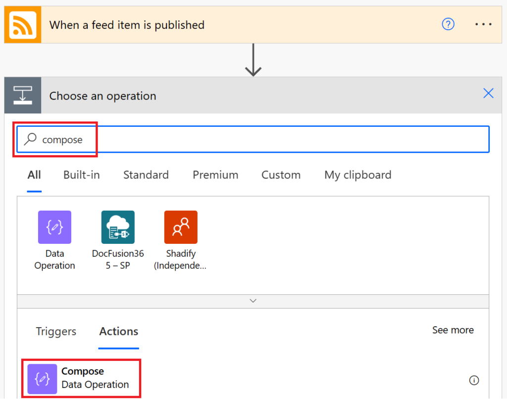

There is a bombardment of information constantly vying for our attention - mobile phones, smart TVs, that [1996 Space Jam website](https://www.spacejam.com/1996/jam.html) and of course [endless cat videos](https://www.youtube.com/results?search_query=cats), which is why I believe the advances in low-code automation have been an incredible benefit for sharing (the most relevant) information with others.

<!-- more -->

And one of my favorites and most eye-catching ways have been through the use of adaptive cards - which we'll explore in this article in combination with Power Automate to share blog feeds.

<figure>


<figcaption>

We're definitely not building something this elaborate!

</figcaption>

</figure>

* * *

I can already hear you saying: "_**Adaptive what?...**_" ok, ok, let's rewind and provide a quick [TLDR](https://www.bing.com/search?FORM=U523DF&PC=U523&q=tldr+meaning&pglt=41&FORM=ANNTA1) about what adaptive cards are and why they can be beneficial.

* * *

## Adaptive cards

**Technical definition:** Adaptive Cards are platform-agnostic snippets of UI, authored in JSON, that apps and services can openly exchange. When delivered to a specific app, the JSON is transformed into native UI that automatically adapts to its surroundings. It helps design and integrate light-weight UI for all major platforms and frameworks.

**Layman's terms:** Make your chat/e-mail messages standout and look [wicked smart](https://www.youtube.com/watch?v=r1g-zDnHF8E).

* * *

## Building excitement

Ok, now that we have a basic understanding of what an adaptive card "is" - let's combine this with a task like having to share information with others **AND** building a sense of excitement by talking about enterprise grade commercial software with our colleagues and friends.

- **Useful scenario:** Sharing a blog post from our favorite technologies whenever a new article is written, which is then automatically posted to a Teams channel. This would allow others to react with hearts, thumbs up, and those random clippy emojis (**Win + .**)📎as they share excitement.

- **Another one:** Sharing our favorite YouTube stars video releases, along with those funny thumbnails where everyone is always surprised like a 90s family sitcom.

- **Another one:** Incorporating our own resources and buttons to capture user interactions and passing those items into other downstream systems to feed the machine click-after-click-after-click.

[Another one, and another one](https://www.youtube.com/watch?v=zIeA2N2Onb8)...

... ok we get it; adaptive cards can be pretty useful so let's start building our own already that will look like the below image when done.


* * *

## [Cut Copy](https://www.youtube.com/watch?v=mgpgkI3eMxM)/Paste

**Minimum Licensing:** [Standard connectors](https://docs.microsoft.com/en-us/connectors/connector-reference/connector-reference-standard-connectors) available within Office 365 E3/E5.

We'll start by navigating to [Power Automate](https://powerautomate.microsoft.com) and the left navigation menu's **My flows** option. Within the **Flows** screen at the top, we'll select **New** **flow** and **Automated cloud flow** to create an event driven flow.


Within the **Build an automated cloud flow** dialog window complete the fields below and select **Create** once done.

- **Flow name:** Power BI RSS Feed

- **Choose your flow’s trigger:** When a feed item is published (RSS)


Within the flow designer we’ll expand our first action **When a feed item is published** and edit the below properties:

- **The RSS feed URL:** https://powerbi.microsoft.com/en-us/blog/feed/

- **Chosen property will be used to determine:** PublishDate


After our **When a feed item is published** action, we'll select the **New step** option.


Within the **Choose an operation** window search for **compose** and select the **Compose (Data Operation)** action.

**Pro-tip:** Compose is the single greatest action ever, period, full stop - it preserves formatting so if you have highly stylized code, which I often find is the case whenever developing robust solutions involving code like HTML/CSS or in this example a JSON payload.



Now within the **Compose** action copy and paste the Code payload JSON into the **Inputs** field.

The code is below the image (and it's kind of long(ish)...).


**Code payload**

```
{
    "type": "AdaptiveCard",
    "body": [
        {
            "type": "TextBlock",
            "size": "large",
            "weight": "bolder",
            "text": "@{triggerOutputs()?['body/title']}",
            "wrap": true
        },
        {
            "type": "ColumnSet",
            "columns": [
                {
                    "type": "Column",
                    "width": "auto",
                    "items": [
                        {
                            "type": "Image",
                            "url": "https://i.imgur.com/p7eoL4C.png",
                            "altText": "Power BI icon"
                        }
                    ]                    
                },
                {
                    "type": "Column",
                    "width": "stretch",
                    "items": [
                        {
                            "type": "TextBlock",
                            "text": "@{triggerOutputs()?['body/summary']}",
                            "wrap": true
                        }
                    ]
                }
            ]
        }
    ],
    "actions": [
        {
            "type": "Action.OpenUrl",
            "title": "Visit the Power BI blog",
            "url": "@{triggerOutputs()?['body/primaryLink']}"
        }
    ],
    "msteams": {
        "width": "Full"
    },
    "$schema": "http://adaptivecards.io/schemas/adaptive-card.json",
    "version": "1.0"
}
```

* * *

**Note for the curious:** From the "ColumnSet" type above, we're creating a two-column table with the first column being the Power BI icon (not a logo) and the second being the text body from a Power Automate trigger from our RSS feeds **When a feed item is published** action.

**Note for the even more curious:** You can utilize the [adaptive card designer](https://www.adaptivecards.io/designer/) and copy and paste the JSON code snippet above into the **CODE PAYLOAD EDITOR** for a preview of what will eventually turn into the snazzy bit of UI in our chat messages. There's so much to explore and if you come up with something cooler - please let me know, I'd love to copy and paste your solution :)

* * *

And to collapse individual actions, we'll select the header text **Compose** (in this example) and select the **New step** option once again to add one last action to our flow.


Within the **Choose an operation** window search for **adaptive** and select the **Post adaptive card in a chat or channel (Microsoft Teams)** action.


Within the **Post adaptive card in a chat or channel** action we'll complete the following values:

- **Post as:** Flow bot (you could also post as yourself... or the robot version of yourself...)

- **Post in:** Channel (hopefully all of your users collaborate in a central Teams channel)

- **Team:** (The team channel name)

- **Channel:** (The place where you envision people probably collaborate the most and chat)

- **Adaptive Card:** Select the value field and the dynamic content menu will pop-up. We can now select the **Outputs** value from our earlier **Compose** action (the thing will all the cool, highly stylized JSON that was so easy to just copy and paste)


And one last step and the most important one of them all... select **Save** and were done. Now whenever new posts get made to the Power BI blog we will automatically post new adaptive card notifications into our favorite Teams channel.


* * *

## All Apologies

Ok, that was probably a super long scroll for what turned out to be three actions (but like I said Compose, Compose, Compose - #ComposeEverything !!!) and in all of the scrolling you've now got an eye-catching method to automate your communication and share the things that may matter the most to other users.

## And don't stop at simply blog posts...

Think about YouTube videos that you could also share with users like those fun Gentleman in a Rectangle ( [https://youtube.com/c/guyinacube](https://youtube.com/c/guyinacube) ), by simply utilizing tools like the [YouTube channel ID finder](https://www.streamweasels.com/tools/youtube-channel-id-and-user-id-convertor/) to get a channel's ID. And then concatenating the YouTube RSS feed URL and Channel Id and now having a RSS feed where you can share your favorite channels with users too.

- **YouTube RSS URL:** https://www.youtube.com/feeds/videos.xml?channel\_id=

- **Channel Id:** UCFp1vaKzpfvoGai0vE5VJ0w

**Full URL:** [https://www.youtube.com/feeds/videos.xml?channel\_id=UCFp1vaKzpfvoGai0vE5VJ0w](https://www.youtube.com/feeds/videos.xml?channel_id=UCFp1vaKzpfvoGai0vE5VJ0w)

## With great power (automate) comes great responsibility

Now that you've fallen in love with automation and adaptive cards, please ensure that end users aren't overwhelmed with hundreds of messages from the Flow bot. If the communication eventually "feels" like spam, people will stop paying attention, stop giving it emojis and flat out consider it annoying.

Which is where I always encourage both posting and interacting with the notifications - share things that you like within the article and giving others a TLDR (too long didn't read) so they don't miss the most important parts - because providing clear and consistent communication in the moments that matter the most is what it's all about.

> "Clear is kind, unclear is unkind."
> 
> Brene Brown ([learn more](https://brenebrown.com/articles/2018/10/15/clear-is-kind-unclear-is-unkind/))
