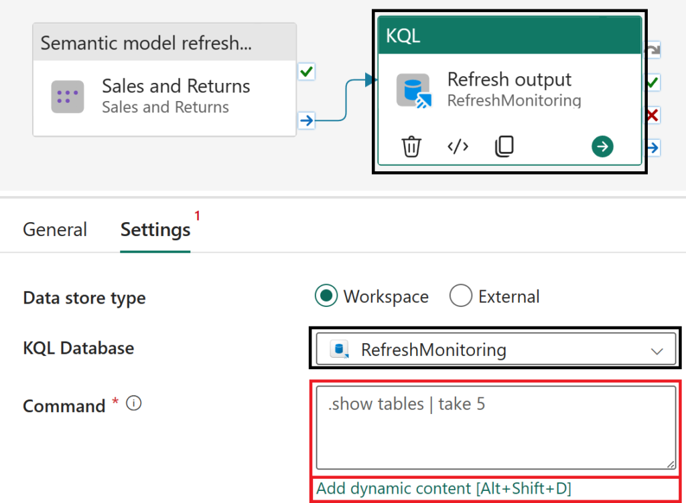
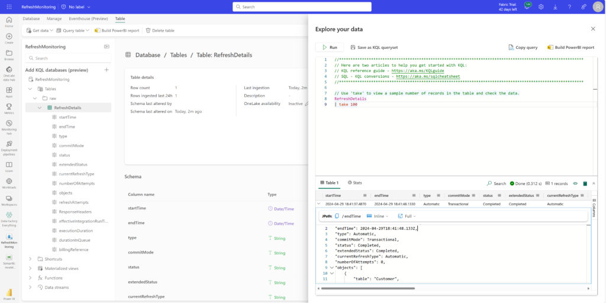

If it’s important, you should probably be logging it. With KQL Databases and the newly introduced Semantic model refresh activity within Data pipelines, its just way too easy (2EZ) now. Before we dive in, let’s look at a few prerequisite items needed for this article:

<!-- more -->

1. Create a new **KQL Database** (if you have an existing KQL Database, even better!).

3. Create a new **Data pipeline** (if you have an existing data pipeline, even better!!!).

After you have added a **Semantic model refresh activity** ([how to](https://learn.microsoft.com/fabric/data-factory/semantic-model-refresh-activity)) to the data pipeline you can then proceed with this quick little setup.

* * *

Select the **Activities** tab and then the more activities ellipses (**...**), within the activities list navigate to the **Transform** group and select the **KQL** activity.


With the KQL activity now added to the canvas, drag-and-drop the **On completion** conditional path between the **Semantic model refresh** and **KQL** activities. This will ensure you're able to capture both successful and unsuccessful refresh activities.


Select the **KQL** activity, navigate to **Settings** and choose your configured KQL Database in a Fabric **Workspace** (data store type). After configuring the settings, select the **Command** parameter input box and the **Add dynamic content** option once visible to insert a dynamic KQL query using the semantic model refresh activity's output.



Copy and paste the following code block into the expression builder.

```
@concat(
    '.set-or-append RefreshDetails with (folder="raw") <|
let pipeOutput = parse_json(```'
, <insert activity output here>
, '```);
print(pipeOutput)
| project todatetime(pipeOutput.startTime)
    , todatetime(pipeOutput.endTime)
    , tostring(pipeOutput.type)
    , tostring(pipeOutput.commitMode)
    , tostring(pipeOutput.status)
    , tostring(pipeOutput.extendedStatus)
    , tostring(pipeOutput.currentRefreshType)
    , toint(pipeOutput.numberOfAttempts)
    , todynamic(pipeOutput.objects)
    , todynamic(pipeOutput.refreshAttempts)
    , todynamic(pipeOutput.ResponseHeaders)
    , tostring(pipeOutput.effectiveIntegrationRuntime)
    , toint(pipeOutput.executionDuration)
    , todynamic(pipeOutput.durationInQueue)
    , todynamic(pipeOutput.billingReference)'
)
```

Highlight the **<insert activity output here>** text within the expression builder and select the activity output option from the **Activity outputs** section. Select **OK** once complete.

| Before | After |
| --- | --- |
|  |  |

One final step is visit the **Home** tab and select the **Run** option (likely you'll also need to save). Hopefully you'll notice within the **Output** section that both activities have succesfully completed.


Jumping over to the KQL Database, since the table has not been created previously, the [set-or-append](https://learn.microsoft.com/azure/data-explorer/kusto/management/data-ingestion/ingest-from-query) command will first create the table on first run and in subsequent refreshes will then append results to the table.



And that's it, you can now view refresh events in your KQL database table. Not too shabby for a UI driven telemetry logging. Honestly, we're barely scratching the surface on all the cool stuff you could do - one ideas here is that you can extend this solution by parameterizing your workspace and dataset id's creating a metadata driven process and invoking a pipeline that utilizes this approach for your semantic model refresh logging. But that's another article for another day :)

A huge shout out for this article goes out to my friend and colleague [Gilles "The baddest man alive with KQL" L'Hérault](https://www.linkedin.com/in/gilleslherault/) for help with the Kusto side. Not only has he helped countless folks learn KQL but he continously wins folks over with sharing his passion for just how powerful Kusto is. If you get the chance connect with him on LinkedIn or in-person please do, he's an absolute riot.
