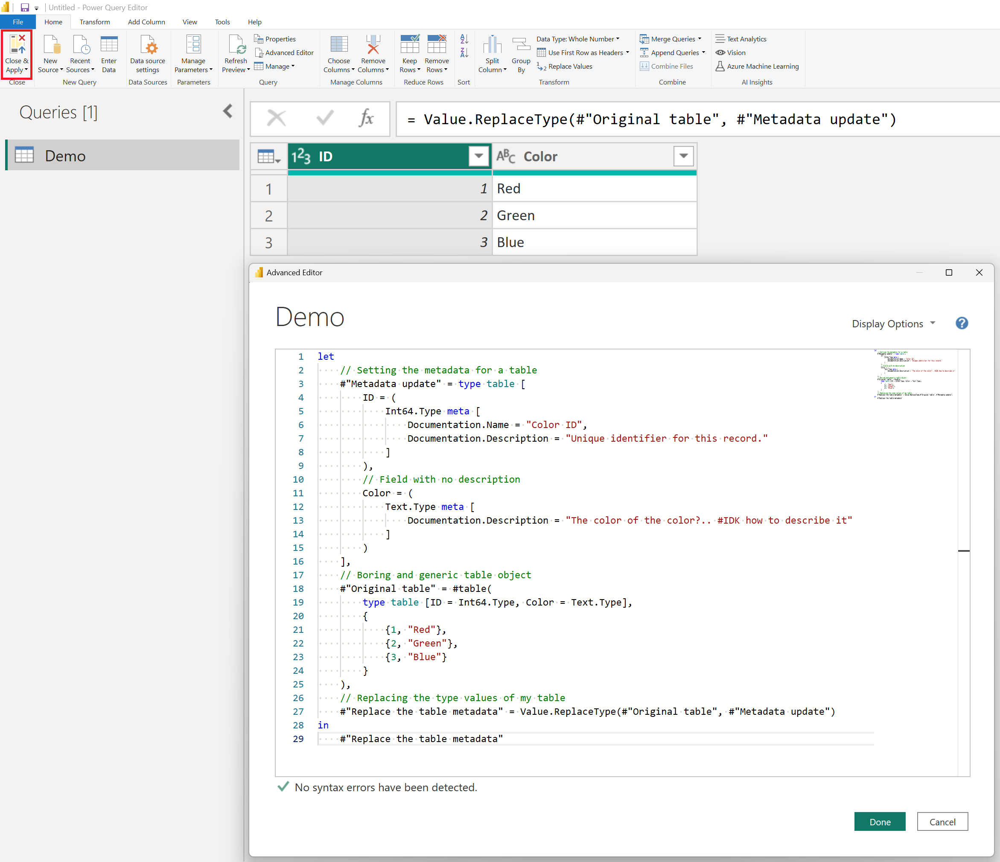
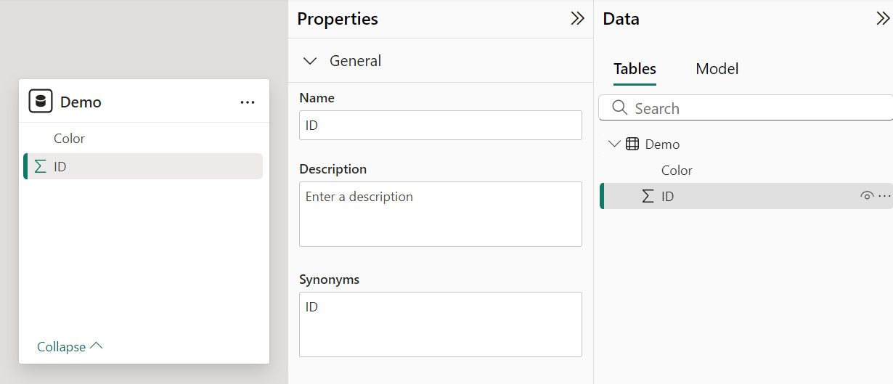

I don't know about you, but my goodness, wouldn't it be great to press **Close & Apply** on Power Query and instantly have all of your columns documented in your model based on metadata definitions in your query? And shoot, why stop there? Let's just leave the column titles exactly as they are from the original source system for easier tracking with our lineage but update to friendlier display names while in the semantic model. It almost sounds too good to be true!

<!-- more -->

Well then let's begin with a straightforward query using everyone's favorite language, Power Query M. In this example, we'll first create a table and then set some metadata properties for both a Name and a Description within the table. You can name these properties anything you like, but for the sake of this example, we'll use the format Documentation.\[Property\] - you can call these **WHATEVER** you want, but I'm trying to instill recommended practices between you, me and everyone on the internet.

```
let
    // Setting the metadata for a table
    #"Metadata update" = type table [
        ID = (
            Int64.Type meta [
                Documentation.Name = "Color ID",
                Documentation.Description = "Unique identifier for this record."
            ]
        ),
        // Field with no description
        Color = (
            Text.Type meta [
                Documentation.Description = "The color of the color?.. #IDK how to describe it"
            ]
        )
    ],
    // Boring and generic table object
    #"Original table" = #table(
        type table [ID = Int64.Type, Color = Text.Type],
        {
            {1, "Red"},
            {2, "Green"},
            {3, "Blue"}
        }
    ),
    // Replacing the type values of my table
    #"Replace the table metadata" = Value.ReplaceType(#"Original table", #"Metadata update")
in
    #"Replace the table metadata"
```

## Straight to the Advanced Editor

Nothing special, just a boring ole three-row table. The important thing, though, is that we took our "Original table" which is of type table and replaced it with an updated definition from the #"Metadata update" which is of type table \[ along with tons of metadata definitions enclosed within these cool square brackets \]. This was achieved using the [Value.ReplaceType](https://learn.microsoft.com/powerquery-m/value-replacetype) function.



"But where's the descriptions?!" I can hear you shouting at the monitor. Hold on, I mentioned earlier "_Wouldn't it be nice_?" - that means I found a way... so please, the P is for Patience. Just one~ish or so more steps.



## Script it

From Power BI, navigate to the External tools tab, so we can launch into everyone's favorite external tool Tabular Editor. If you don't already have it installed, follow my tutorial over at [https://aka.ms/pbiworkshops](https://aka.ms/pbiworkshops) in the Tabular Editor in an Hour folder, it's an amazing tool and my incoherent ramblings for this article won't do it justice.


Once connected to our semantic model, select the C# tab (see image below) and paste the script provided below the image also. While this script "**_works_**", I'm sure someone will undoubtedly write a better version. When that happens, I'll update it to version 2 and give credit to the individual who beat GPT, after my numerous failed attempts to finally get this built. Also, I know someone will write this into Semantic Link Labs too, so I'll post there when it gets updated.

The key here is that we are targeting the \[Name\] and \[Description\] fields without altering the actual \[Source Column\] property of our BIM (Business Intelligence Model). In this example, our \[ID\] column will be updated to the more user-friendly name "Color ID" and given the description "Unique identifier for this record."

Once ready, press the green play button and LFG!!!


```
// This script retrieves the M expression for all partitions in the model
using System.Text.RegularExpressions;

foreach (var table in Model.Tables)
{
    var tableName = table.Name;

    foreach (var partition in table.Partitions)
    {
        if (partition.SourceType == PartitionSourceType.M)
        {
            var mExpression = partition.Expression;
            var pattern = @"(\w+)\s*=\s*\([^)]*meta[^\]]*\]";
            var matches = Regex.Matches(mExpression, pattern);

            // If metadata found proceed with matches
            if (matches.Count > 0)
            {
                foreach (Match match in matches)
                {
                    // Column name
                    string columnName = match.Groups[1].Value;

                    // Find Documentation.Description in expression
                    string descriptionPattern = @"Documentation\.Description\s*=\s*""([^""]+)""";
                    Match description = Regex.Match(match.Value, descriptionPattern);

                    // If success document the column description
                    if (description.Success)
                    {
                        string docDescription = description.Groups[1].Value;
                        Model.Tables[tableName].Columns[columnName].Description = docDescription;
                    }
                    
                    // Find Documentation.Name in expression
                    string namePattern = @"Documentation\.Name\s*=\s*""([^""]+)""";
                    Match name = Regex.Match(match.Value, namePattern);

                    // If success document the column description
                    if (name.Success)
                    {
                        string docName = name.Groups[1].Value;
                        Model.Tables[tableName].Columns[columnName].Name = docName;
                    }
                }
            }
        }
    }
}
```

* * *

And just like that, our column has been updated to reflect the underlying metadata defined in our Power Query M expression. As you share solutions like Dims and Facts across your organization, this can be a great way to ensure consistency in design and descriptions. Pretty neat, huh?


Of course, I'd love to see this as a native capability in the product, especially with Power Query Online's schema view interface. Imagine a Description field where you can click into each column and write a quick summary. Heck let's even make Copilot do it, they love documenting stuff (documenting is borrrrring)! Or, if you connect to a source that has these stored in a system table, automatically importing them and injecting them into your scripts.


The M-agination is limitless when it comes to this stuff.
